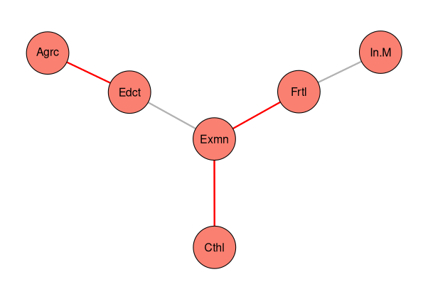

# Snha package

R package which implements the St. Nicolas House Algorithm (SNHA) for
constructing networks of correlated variables using a ranking of the pairwise
correlation values. The package contains the R code for the papers:

- Groth, D., Scheffler, C., & Hermanussen, M. (2019). Body height in stunted
  Indonesian children depends directly on parental education and not via
  a nutrition mediated pathway-Evidence from tracing association chains by St.
  Nicolas House Analysis. Anthropologischer Anzeiger, 76(5), 445-451. 
  [https://doi.org/10.1127/anthranz/2019/1027](https://doi.org/10.1127/anthranz/2019/1027)
- Hermanussen, M., Aßmann, C., & Groth, D. (2021). Chain Reversion for Detecting 
  Associations in Interacting Variables—St. Nicolas House Analysis. 
  International journal of environmental research and public health, 18(4), 1741
  [https://doi.org/10.3390/ijerph18041741](https://doi.org/10.3390/ijerph18041741)

For an implementation of the algorithm in Python look here
[https://github.com/thake93/snha4py](https://github.com/thake93/snha4py).

## Installation

```
library(remotes)
remotes::install_github("https://github.com/mittelmark/snha")
```

Thereafter you can check the installation like this:

```
library(snha)
citation("snha")
```

Which should display something like this:

```
> citation("snha")
To cite package 'snha' in publications use:

> citation("snha")

To cite package ‘snha’ in publications use:

  Detlef Groth, University of Potsdam (2023). snha: St.
  Nicolas House Algorithm for R. R package version 0.1.

...
```

## Example

The package has a function `snha` where you give your data as input. The
function creates an object of class `snha` which you can plot and
explore easily. Here an example just using the `swiss` data which are part of
every R installation:

```r
> library(snha)
> library(MASS)
> data(swiss)
> colnames(swiss)=abbreviate(swiss)
> as=snha(swiss,method="spearman")
> plot(as)
> plot(as,layout="sam",vertex.size=8)
> ls(as)
[1] "alpha"         "chains"        "data"          "method"
[5] "p.values"      "probabilities" "sigma"         "theta"
[9] "threshold"
> as$theta
     Frtl Agrc Exmn Edct Cthl In.M
Frtl    0    0    1    0    0    1
Agrc    0    0    0    1    0    0
Exmn    1    0    0    1    1    0
Edct    0    1    1    0    0    0
Cthl    0    0    1    0    0    0
In.M    1    0    0    0    0    0

```



The theta object contains the adjacency matrix with the edges for the found
graph. For more details consult the package vignette:
`vignette(package="snha","tutorial")` or the manual package of the package
`?snha` or `?'snha-package'`.

## Author and Copyright

Author: Detlef Groth, University of Potsdam, Germany

License: MIT License see the file [LICENSE](LICENSE) for details.

## Bug reporting

In case of bugs and suggestions, use the [issues](https://github.com/mittelmark/snha/issues) link on top.
